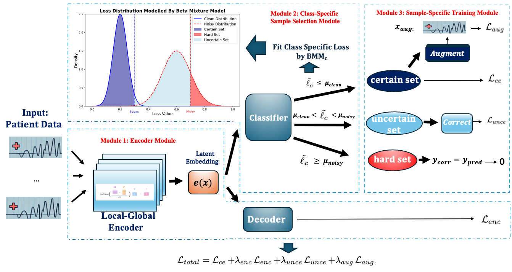

#   Dynamical Label Augmentation and Calibration for Noisy Electronic Health Records
[*"Dynamical Label Augmentation and Calibration for Noisy Electronic Health Records"*](https://openreview.net/forum?id=9D0fELXbrg) (PAKDD-25).


## Abstracts
Medical research, particularly in predicting patient outcomes, heavily relies on medical time series data extracted from Electronic Health Records (EHR), which provide extensive information on patient histories. Despite rigorous examination, labeling errors are inevitable and can significantly impede accurate predictions of patient outcomes. To address this challenge, we propose an Attention-based Learning Framework with Dynamic Calibration and Augmentation for Time series Noisy Label Learning (ACTLL). This framework leverages a two-component Beta mixture model to identify the certain and uncertain sets of instances based on the fitness distribution of each class, and it captures global temporal dynamics while dynamically calibrating labels from the uncertain set or augmenting confident instances from the certain set. Experimental results on large-scale EHR datasets eICU and MIMIC-IV-ED, and several benchmark datasets from the UCR and UEA repositories, demonstrate that our model ACTLL has achieved state-of-the-art performance, especially under high noise levels.

<div align="center">

</div>

## Data
### Benchmark Data
We evaluate our model on publicly available time-series classification datasets from the UCR and UEA repositories:

[The UCR time series archive](https://ieeexplore.ieee.org/abstract/document/8894743)

[The UEA multivariate time series classification archive, 2018](https://arxiv.org/abs/1811.00075)

- Note: you may have to manually download: Univariate2018_ts.zip and Multivariate2018_arff.zip
- Then decompress and rename the decompressed folder as  'ucr\_data' and 'uea\_data' respectively
- Put them into 'src/ucr_data', 'src/uea_data' directory

### EHR data
For the EHR datasets, you need to get download access first before proceeding:

[MIMIC-IV-ED](https:/physionet.org/content/mimiciv/1.0/)

To get preprocessed MIMIC-IV-ED dataset, follow the same preprocessing procedure as [CAMELOT](https://github.com/hrna-ox/camelot-icml)
- Download the MIMIC-IV-ED
Download the core directory from MIMIC-IV
- Download the data preprocessing pipeline: [link](https://github.com/hrna-ox/camelot-icml/tree/main/src/data_processing/MIMIC)
- Run the scripts by python run_processing.py 
- Put folder "MIMIC" into 'src/EHR\_data/MIMIC'

[eICU](https://physionet.org/content/eicu-crd/2.0/.)

To get preprocessed eICU dataset: Follow the same procedure in eICU Pre-Processing section in [GNN-LSTM](https://github.com/EmmaRocheteau/eICU-GNN-LSTM)
- Note: eICU dataset can be extremely cumbersome to process, please be patient.
- Put folder "eICU" into 'src/EHR\_data/eICU'


## Requirements
The packages our code depends on are in ```./requirements.txt```.

## Usage
To train ACTLL on 15 benchmark datasets mentioned in this paper, run
```bash
nohup python ./src/main.py --model ACTLLv3 --epochs 300 --lr 1e-3 --label_noise 0 --ni 0.3 --num_workers 1 --mean_loss_len 10 --gamma 0.3 --cuda_device 0 --outfile CTW.csv
```
The results are put in ```./statistic_results/```. 

For other examples, please refer to ```./run_sym30.sh```.


## Acknowledgement
We adapted the following open-source code to implement the state-of-the-art algorithms
* [SIGUA](https://github.com/bhanML/SIGUA)
* [Co-teaching](https://github.com/bhanML/Co-teaching) 
* [MixUp-BMM](https://github.com/PaulAlbert31/LabelNoiseCorrection)
* [Dividemix](https://github.com/LiJunnan1992/DivideMix)
* [SREA](https://github.com/Castel44/SREA)
* [CTW](https://github.com/qianlima-lab/CTW)


## Citation
If you use this code for your research, please cite our paper:
```
@inproceedings{
liu2023scaleteaching,
title={Scale-teaching: Robust Multi-scale Training for Time Series Classification with Noisy Labels},
author={Zhen Liu and Peitian Ma and Dongliang Chen and Wenbin Pei and Qianli Ma},
booktitle={Thirty-seventh Conference on Neural Information Processing Systems},
year={2023},
url={https://openreview.net/forum?id=9D0fELXbrg}
}
```